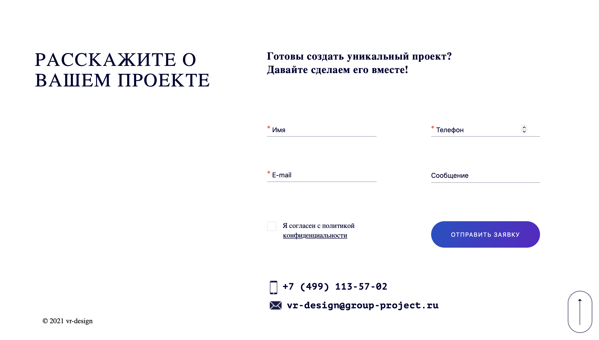
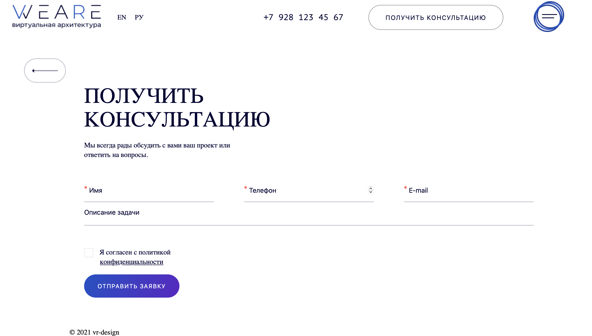

# WEARE reality

A responsive Virtual reality website 

## Getting started

Host the parent directory on the webserver

## Technologies:

<code></code>
<code></code>

## Link to Figma

https://www.figma.com/file/6Vmub4lqmoZZA5UOOC4eZk/Untitled?type=design&node-id=138-1764&mode=design

## Thanks to all Contributors

## Result:
